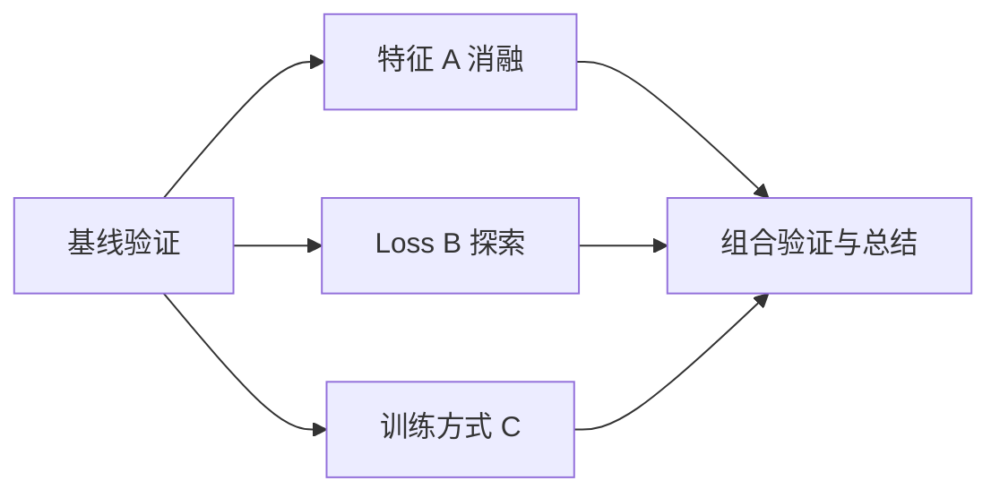

# Task Workbench · 任务工作台

把项目、探索节点、计划、执行进度、反馈和结论放在一个本机工作台里。支持 Codex CLI、Claude Code，以及通过适配协议接入的其他 coding agent。

**当前阶段：v0.2，项目探索与 Trajectory。** 适合在 macOS 上体验；Linux 会运行自动化兼容检查。Windows 原生运行尚未验证。

## 在另一台 Mac 上开始

需要 Python 3.9+ 和 Git。无需安装 Python 第三方库或前端依赖。

```sh
git clone https://github.com/Anais-Y/task-workbench.git
cd task-workbench
./task-workbench doctor
./task-workbench start
open http://127.0.0.1:8766/
```

也可以双击 `启动任务工作台.command`。诊断命令会告诉你找到了哪些 Agent；“已找到”不代表已经登录。

首次启动会创建一个名为 **建立一个任务管理器** 的空项目，工作目录指向当前仓库。可以直接新建任务，也可以从项目选择器添加其他项目，选择该设备上的已有文件夹。

每台设备保存各自的任务数据。克隆代码不会复制另一台设备的任务记录、登录状态或本机配置。

停止与重新启动：

```sh
./task-workbench stop
./task-workbench start
```

关闭浏览器不影响后台服务；电脑重启后需要重新启动。不会配置开机自启。若需要在终端查看服务输出，使用 `./task-workbench serve`，按 Ctrl+C 停止。

已有安装可以先停止任务与服务，备份 `.data/`，再运行 `git pull --ff-only` 并重新启动。v0.2 会自动升级原有任务库，保留项目、任务和原始时间记录。

## 一次完整的工作流程

### 项目 → 探索节点 → 任务

项目代表长期目标，例如“优化召回模型”；节点代表一次有独立假设和结论的探索，例如“特征 A 消融”“调整 loss”；任务是节点下面实际交给 worker 的工作，计划还可以拆出子任务。

- 在 **探索节点** 创建方向、填写假设并选择颜色。同一节点的任务保持相同颜色，同时显示节点名称。
- 节点可以分叉，也可以选多个前序节点，表示综合几项实验做进一步验证。节点关系记录研究脉络；执行顺序仍由任务的前序依赖控制。
- 从节点创建任务，或在任务详情里调整归属。计划生成的子任务自动继承节点；调整归属会同步整组父任务和子任务，运行或排队中的任务需先停止。
- 节点详情可以记录“采用 / 不采用 / 暂无定论”及结论。任务完成不会自动被解释为实验有效；结论由你或经授权的 Agent 明确记录。
- **Trajectory** 展示分支汇合关系和带日期的里程碑。修订结论会保留之前的版本，方便回看尝试过哪些方案、为什么采用或放弃。



旧任务继续保留，可以逐步归入节点。旧版缺失的历史状态不会被补写成实验事实；升级时的状态会明确标记为迁移快照。

### 项目管理与回收站

通过 **项目管理** 将不需要的项目删除到回收站，也可以恢复。项目内任务、节点、历史都会保留，本机项目文件夹不会被删除。有运行或排队任务时，先停止这些任务后再删除项目。

### 任务执行

1. **新建任务**：填写目标、验收标准、项目和 Agent。默认先生成计划，也可直接执行；保存任务不会自动启动。
2. **审核计划**：Agent 生成任务拆分后进入“待你处理”。可以反馈修改，也可以批准计划。
3. **分发执行**：批准后创建带依赖的子任务。最多同时运行 3 个本机 worker，前置任务验收完成后再放行后续任务。
4. **看结果**：打开任务可查看日志、会话、执行轮次与产物。Agent 返回结果后进入待验收，不会直接当作成功交付。
5. **继续改进**：反馈会继续同一个 Agent 会话；失败可重试，历史记录保留；运行中可取消。

进度条显示已确认的步骤数，不估算“AI 已完成百分之几”。页面约每 2 秒更新，保留编辑中的反馈草稿与光标位置。

## 可插拔，具体指什么

| 接入口 | 能做什么 | 如何扩展 |
| --- | --- | --- |
| 网页 | 创建、查看、审核和反馈任务 | 不依赖具体 Agent |
| 命令行 | 从脚本或终端操作同一份任务记录 | `./task-workbench --help` |
| MCP | 让支持 MCP 的 Agent 调用工作台工具 | 配置一个 stdio MCP 服务 |
| Agent 适配 | 启动 CLI，统一日志、会话、结果与取消 | 配置命令参数及 JSONL / 文本输出协议 |

它不会自动识别任意 CLI 的私有协议。接入其他 Agent 时，需要该 Agent 支持相应输出，或编写一个小包装程序。任务系统、网页与调度器无需跟着更换。

### Codex CLI

本机实际验证过“生成计划 → 批准 → 子任务创建文件 → 验收 → 父任务完成”。支持流式事件与定向会话恢复；计划阶段只读，执行阶段使用工作区写入权限。安装和登录遵循 [Codex CLI 官方说明](https://developers.openai.com/codex/cli/)。

### Claude Code

已实现 stream-json 事件、会话恢复、计划模式、文件编辑和取消。适配器检查通过；开发机实际调用提示尚未登录，因此真实 Claude 全流程需要在已登录的设备上验收。请先按 [Claude Code 官方安装说明](https://code.claude.com/docs/en/setup)安装并登录，再从工作台选择 Claude。

CLI 的额外工具权限仍由 Claude 控制；未获允许会记录失败原因。工作台不代替用户登录，不绕过权限检查，也不覆盖 CLI 的模型选择。

### 不依赖模型账号的接入检查

仓库提供一个明确标注的 **协议演示 Agent（不是 AI）**。它作为独立子进程运行，用来检查可插拔接口、日志、产物、会话恢复与取消：

```sh
python3 examples/check_custom_agent.py
```

自检使用隔离目录，不修改你的任务库。通过只说明接入协议可用，不代表任何未实测的 coding agent 都已兼容。

想在网页里试用这个示例，按照 [自定义 Agent 示例](examples/README.md)生成独立配置并启动服务。

接入自己的 Agent 可参考 `adapters.example.json` 和 [适配协议](docs/ADAPTERS.md)。本机配置 `adapters.json` 不会提交到 Git。

## 在 Codex / Claude Code 里操作这个工作台

先启动工作台，再在仓库目录执行以下配置命令之一。工具共享同一份本机数据，不会各建一套看板。

```sh
TASK_WORKBENCH_DIR="$(pwd)"
codex mcp add task-workbench -- "$TASK_WORKBENCH_DIR/task-workbench" mcp
```

```sh
TASK_WORKBENCH_DIR="$(pwd)"
claude mcp add --transport stdio task-workbench -- "$TASK_WORKBENCH_DIR/task-workbench" mcp
```

其他 MCP 客户端使用以下结构，把路径替换为实际克隆目录：

```json
{
  "mcpServers": {
    "task-workbench": {
      "command": "/absolute/path/to/task-workbench/task-workbench",
      "args": ["mcp"]
    }
  }
}
```

提供项目、任务、产物工具，以及 `list_nodes`、`create_node`、`update_node`、`list_trajectory`、`assign_task_node`、`project_action`。MCP 配置和登录都保留在各自设备上。任务的 `nodeId` 和节点历史通过相同 API 共享，其他 Agent 无需依赖网页。

## 命令行示例

```sh
./task-workbench projects
./task-workbench tasks --project task-manager
./task-workbench create --project task-manager --title "检查 README 的启动步骤" --engine codex
./task-workbench action T001 start
./task-workbench action T001 approve_plan
./task-workbench action T002 feedback --message "请补充验证结果"
./task-workbench action T002 accept
```

任务 ID 仅为示例，请使用实际返回值。创建时加 `--execute` 跳过规划，加 `--start` 立即排队。

节点和历史同样可从 CLI 操作：

```sh
./task-workbench nodes --project task-manager
./task-workbench node-create --project task-manager --title "特征 A 消融" --hypothesis "改善冷启动样本" --color blue
./task-workbench trajectory --project task-manager
./task-workbench projects --include-deleted
```

使用返回的节点 ID，通过 `create --node 节点ID` 将新任务归入节点，或通过 `assign-node 任务ID 节点ID` 调整已有任务。用 `node-update 节点ID --outcome adopted --conclusion "结论与证据"` 保存结论；`--parent` 可重复指定，用来表达多个前序节点汇合。

## 当前边界

- **本机运行**：界面和 CLI 在同一台设备上，不提供跨设备同步或公网访问。
- **共享项目目录**：同一项目下的任务共用工作目录；尚未自动为每个 worker 创建 Git worktree、合并分支或处理编辑冲突。并行任务需要分清文件范围。
- **进度来源**：网页启动的 CLI 任务自动更新；其他系统内部的 worker 只有显式上报后才会显示，工作台不会自动读取所有 Codex/Claude 对话。
- **产物预览**：支持项目目录内的文本文件；图片和 PDF 等文件请在项目目录打开。
- **验证范围**：开发机完整验证 Codex；Claude 仍需在已登录设备实测。其他 Agent 需要按协议适配。

## 数据、验证与开发

任务库与运行日志保存在 `.data/`，不会上传 GitHub。备份前先停止服务，再备份该目录。恢复到另一台设备时还需调整项目文件夹路径；第一版尚未提供路径迁移工具。

```sh
python3 -m unittest discover -s tests -v
python3 examples/check_custom_agent.py
```

自动化检查使用临时数据库和可控 Agent，不消耗模型额度。`tests/live_smoke.py` 需手动运行，会实际调用 Codex，在临时目录检查完整计划与执行流程。

- [另一台设备验收清单](docs/CROSS-DEVICE-CHECKLIST.md)
- [接口与开发约定](CONTRACT.md)
- [首轮开发 To-Do](BUILD-TODO.md)
- [开发机第一阶段验证记录](TEST-REPORT.md)

核心文件：`taskboard/store.py` 保存数据，`runner.py` 管理生命周期，`adapters.py` 连接 Agent，`server.py` 提供本机接口，`cli.py` / `mcp.py` 提供入口，`web/` 提供界面。
